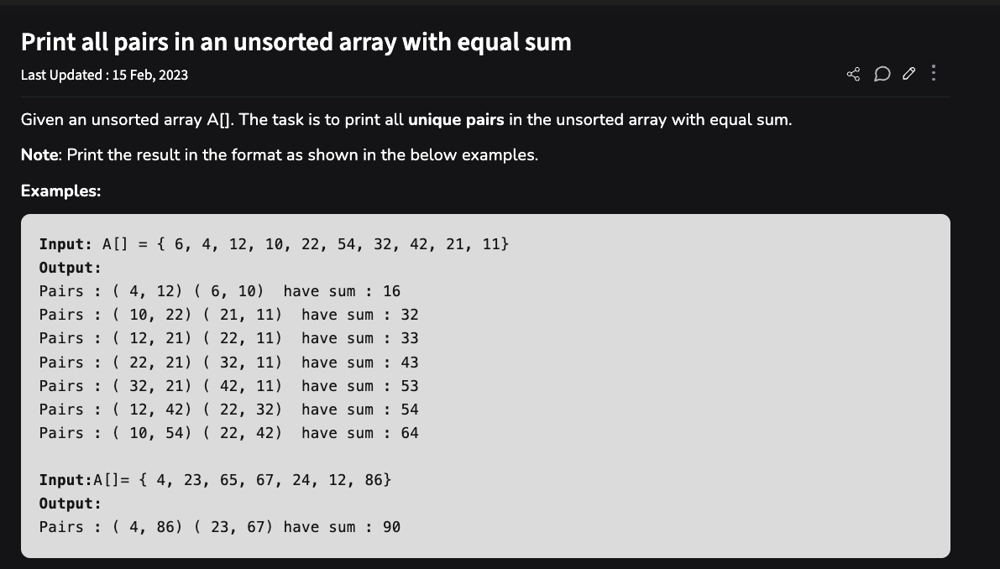

# pair-finder

## Task given to me



## Style guide

[PEP 8 style guide](https://peps.python.org/pep-0008/) is followed for writing the code 

## Dependency

The solution is written in python3. If you don't have python3 in your 
machine, please install it. For details can check [python 3 download and 
installation](https://www.python.org/downloads/) 

## How to run the tests

[unittest framework](https://docs.python.org/3/library/unittest.html) is 
used for the testing code. 

To run the test go to the root folder of the project.

Then give the following command in terminal.

```
python -m unittest test_solution.py
```

Then output would be shown like this:

```
....
----------------------------------------------------------------------
Ran 4 tests in 0.001s

OK
```

## How to run the main program

Please go to the root folder of the project. 

Then give this following command in terminal.

``` 
python main.py
```

Then the main program is started in an infinite loop. 

Please give input the whole integer array (space separated) and then press enter.

Like this:

``` 
6 4 12 10 22 54 32 42 21 11
```


If a valid input is given then the output would be like this:

``` 
Pairs : ( 4, 12) ( 6, 10) have sum : 16
Pairs : ( 10, 22) ( 21, 11) have sum : 32
Pairs : ( 12, 21) ( 22, 11) have sum : 33
Pairs : ( 22, 21) ( 32, 11) have sum : 43
Pairs : ( 32, 21) ( 42, 11) have sum : 53
Pairs : ( 12, 42) ( 22, 32) have sum : 54
Pairs : ( 10, 54) ( 22, 42) have sum : 64
```

If any invalid input is given like `1 f 2` then the program will give 
an warning for invalid input.
Like this:
``` 
The input is invalid. Please give a valid input. Exception:  invalid literal for int() with base 10: 'f'
```

After any output the program will continue to run and wait for another input.
